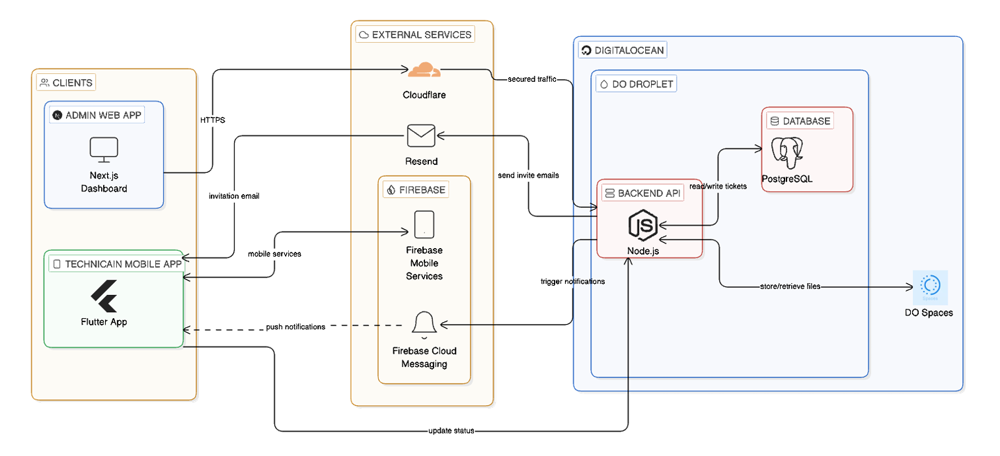
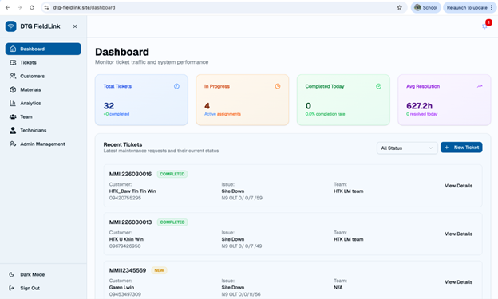
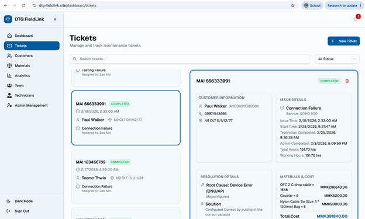
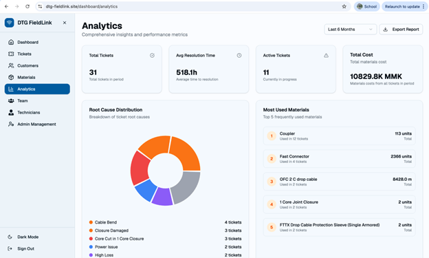
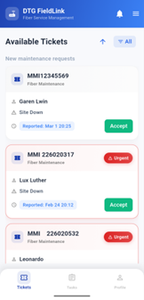
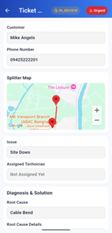

# DTG FieldLink — Field Service Management System

> **"Faster Fix, Smarter Sync"** — A dual-platform Field Service Management System built for Dynamic Technology Group (DTG) Co. Ltd., a third-party ISP maintenance provider in Myanmar.

---

## 🧩 Overview

DTG previously managed all field operations through LINE messaging groups and manual Excel spreadsheets — causing data duplication, billing errors, and zero real-time visibility.

DTG FieldLink replaces this entirely with a centralized dual-platform system:
- **Admin Web App** (Next.js) — for dispatchers to manage tickets, teams, and analytics
- **Technician Mobile App** (Flutter/Android) — for field technicians to receive tasks, log work, and navigate sites

---

## ✨ Key Features

**Admin Web Application**
- Ticket creation, assignment, and full lifecycle tracking
- Real-time dashboard with performance metrics
- Customer and technician management
- Material catalog with unit/length-based pricing
- Automated monthly Excel report generation for ISP reimbursements
- Analytics with customizable date filtering
- Activity logs with automatic 3-month archiving

**Technician Mobile Application**
- Real-time push notifications via Firebase Cloud Messaging (FCM)
- View assigned tickets with full issue details
- Google Maps integration — renders `.kmz` / GeoJSON site overlays automatically
- Material usage logging and photo uploads to DigitalOcean Spaces
- Breaktime tracking for accurate net repair time calculation
- Ticket status updates: New → In Progress → In Review → Completed

---

## 🛠 Tech Stack

| Layer | Technology |
|---|---|
| Frontend (Web) | Next.js, TypeScript, Tailwind CSS |
| Mobile | Flutter, Dart, Riverpod, go_router |
| Backend | Node.js, Express.js, REST API |
| Database | PostgreSQL (hosted on DigitalOcean Droplet) |
| File Storage | DigitalOcean Spaces (S3-compatible) |
| Notifications | Firebase Cloud Messaging (FCM) |
| Email | Resend |
| Maps | Google Maps API |
| DNS & Security | Cloudflare |
| DevOps | Docker, docker-compose |

---

## 🏗 System Architecture

---

## 📸 Screenshots

### Web Application

### Mobile Application

---

## 👥 Team

Collaborated with **Khant Min Lwin** and **Thet Myat Noe Thwin**  
Advised by **Asst. Prof. Dr. Paitoon Porntrakoon**  
Assumption University Thailand — Senior Project 2 (2/2025)

---

## 📄 License

This project was developed as an academic senior project in collaboration with a real client. Not open-sourced.
